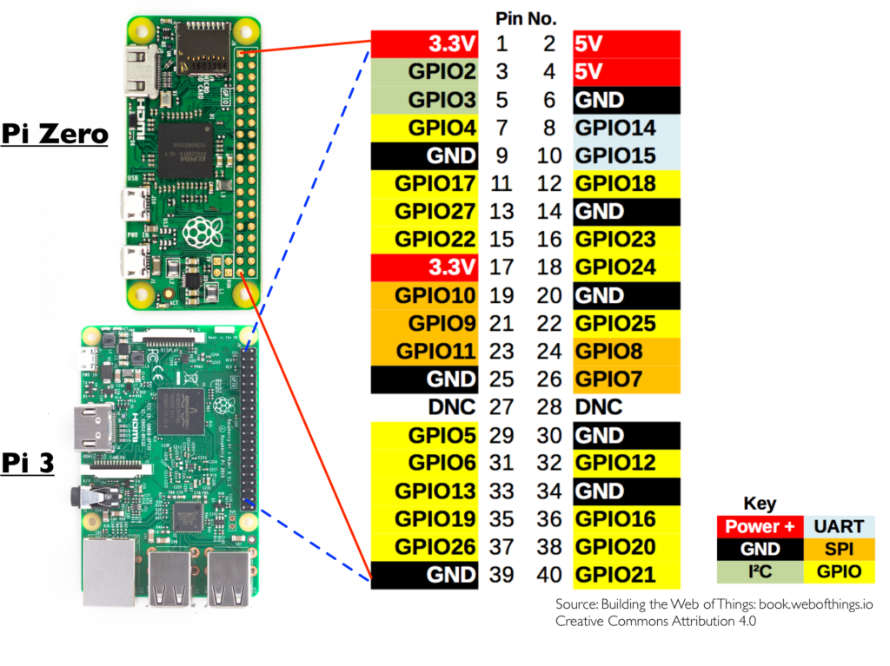

# Sensor für Tempearute Automation

Mit diesem Projekt können Daten eines Temperatursensors an einen Server geschickt werden.

**Bevor die Daten des Sensors an einen Server gesendet werden kann, muss der zugehörige Server installiert werden: https://git.haw-hamburg.de/acj509/temp_automation.git !**

## Voraussetzungen

- Raspberry Pi auf dem Linux installiert ist
- Git
- Zugriff über einen Terminal
- AM2302 oder DHT22 Sensor

## Anschließen

Die Standarteinstellung sieht folgenden Anschluss vor:

1. Neutralleiter geht auf eine Erde (Bsp. Pin no 9 )
2. Spannungversorgung geht auf 3,3V Anschluss (Bsp. Pin no1)
3. Daten Pin geht auf GPIO4 (Pin no 7)



## Installation

Es müssen folgende Befehle durchgeführt werden:

```
cd /home/pi/
git clone https://git.haw-hamburg.de/acj509/temp_automation_sensor.git
chmod 777 -R temp_automation_sensor/
cd temp_automation_sensor/
./run_init.sh
```

Zur Überprüfung sollte im Crontab geschaut werden, ob sich dort ein neuer Eintrag befindet

```
contab -e
```

Hier müsste in Eintrag befindent der ungeäht so aussieht:

```
# added by temp automation sensor
* * * * * /home/pi/run_sensor.sh
```

Wenn dies nicht der Fall ist, trage die Zeilen bitte manuell ein.
Um aus der Crontab heraus zu kommen muss Xrt+S und dann Crt+X gedürckt werden.

Ihr Raspberry Pi sendet nun minütlich Daten an den Server.

## Settings

Hier können Daten verändert werden.

```json
{
  "pin": 4,
  "server_base_url": "http://127.0.0.1:8080"
}
```

Dier Server Base Url muss in dieser Datei geändert werden. Dort muss die IP des Servers stehen. Dies geschieht durch:

```
cd /home/pi/temp_automation_sensor/
sudo nano settings.json
```

Trage die richtige Url (evtl. mit Port) bei "server_base_url" ein und drücke erst Crt+S und dann Crt+X.
